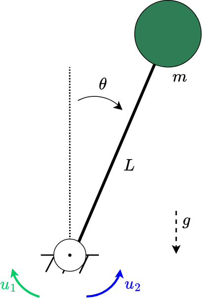

# Passive Fault Tolerant-Augmented Neural Lyapunov Control  

This repository contains the results of different controller laws tested over an inverted pendulum with a redundant actuators set.
The controlled system is depited in Figure



## 1) Inverted Pendulum results
Hereby the comparison of three control laws: an LQR, a vanilla ANLC (vANLC) and a Fault Tolerant Augmented Neural Lyapunov Control. 

### Nominal case
As expected, all the control law work in the nominal scenario (no faults):


LQR                        |  vANLC                    | FTANLC
:-------------------------:|:-------------------------:|:-------------------------:
.gif) | .gif) | .gif)


### Fault affecting the first actuator
LQR                        |  vANLC                    | FTANLC
:-------------------------:|:-------------------------:|:-------------------------:
.gif) | .gif) | .gif)


### Fault affecting the second actuator
LQR                        |  vANLC                    | FTANLC
:-------------------------:|:-------------------------:|:-------------------------:
.gif) | .gif) | .gif)


## 2) Reference

The related manuscript will be available in the Proceedings of the IEEE CDC Conference (estimated date: January 2024).  
  
```
@inproceedings{
    title={Systematic synthesis of passive Fault-Tolerant Augmented Neural Lyapunov Control laws for overactuated systems},
    author={Davide Grande, Davide Fenucci, Andrea Peruffo, Enrico Anderlini, Alexander B. Phillips, Giles Thomas, Georgios Salavasidis},
    booktitle={62nd IEEE Conference on Decision and Control},
    year={2023}
}
```


